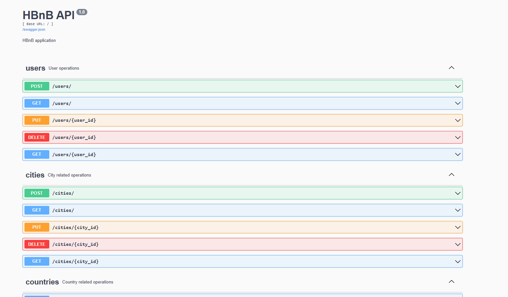

# HBnB API

The HBnB API is a RESTful API for managing user bookings for accommodations and providing essential information about places, reviews, amenities, and more.

## Features

- **User Management:** Create, retrieve, update, and delete users.
- **Country and City Information:** Retrieve details about countries and cities.
- **Accommodation Places:** Manage places and their amenities.
- **Reviews:** Create, retrieve, update, and delete reviews for places.
- **Amenities:** Manage amenities available at places.

## Usage

Explore the API endpoints using tools like Postman or directly through your browser. API documentation (Swagger UI) is available at http://localhost:5000/swagger after starting the application.

Example for it:


## Entity Relationship Diagram

Please check the ERD diagram for a visual representation of the HBnB API architecture like that:

.png)

## Installation

### Prerequisites

- Python 3.9 or higher
- pip (Python package installer)

### Git Clone the Repository

```bash
git clone https://github.com/rafigmammadov/holbertonschool-hbnb-db
cd HBnB-API
```

### Install Dependencies

Install required Python packages using pip:

```bash
pip install -r requirements.txt
```

### Run the Application

python3 -m app.py

### Contributing

Contributions are welcome! Please fork the repository and create a pull request.

### Authors

Rafig Mammadov
Amina Jabbarova
Rufat Jabbarov
